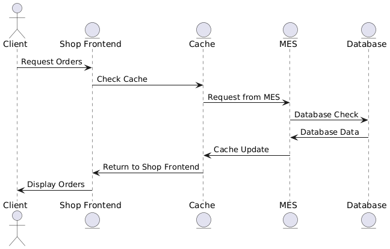

# Архитектурное решение по кешированию
## Мотивация:
В текущей архитектуре CRM и Shop работают медленно, особенно при отображении списка заказов. MES перегружен повторными запросами на расчёт и загрузкой метаинформации по 3D-моделям.
Кеширование позволит значительно ускорить работу интерфейса операторов и клиентов, снизить нагрузку на MES и облачное хранилище.
## Предлагаемое решение:
1. Кешируем через Redis:
   - заказы для быстрого открытия дашборда
   - результаты расчета, чтобы не вызывать MES повторно
   - метаинформацию модели, чтобы разгрузить S3 (вес, дата загрузки, превью)
## Диаграмма последовательности:

## Сравнение стратегий кеширования:

Write-Through — для расчёта стоимости и метаинформации модели
Почему:
1. Эти данные возникают при чётко определённых действиях (расчёт завершён / модель загружена).
2. Мы можем гарантированно записывать их в кеш сразу после генерации.
3. Они редко меняются — важно, чтобы кеш и база всегда были синхронизированы.

Refresh-Ahead — для списка заказов на дашборде
Почему:
1. Эти данные запрашиваются постоянно (операторы заходят по 100 раз в день).
2. Можно предсказуемо обновлять кеш заранее (например, каждые 15 сек).
3. Обновления идут редко, но чтения — часто.

Cache-Aside: слишком “ленивый”, будет постоянно читать из базы, пока кеш не наполнится. UX страдает.
Write-Behind: крутой для логов, но рискованный для заказов — можно потерять запись в БД.
Read-Through: хорош там, где инфраструктура уже построена под него.